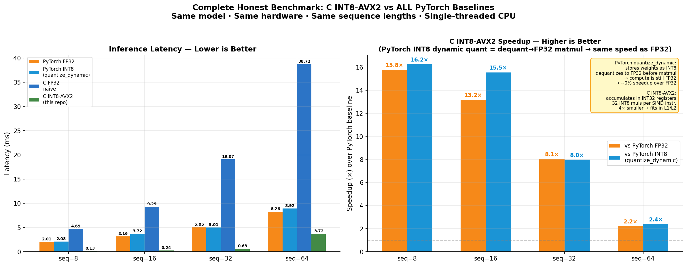
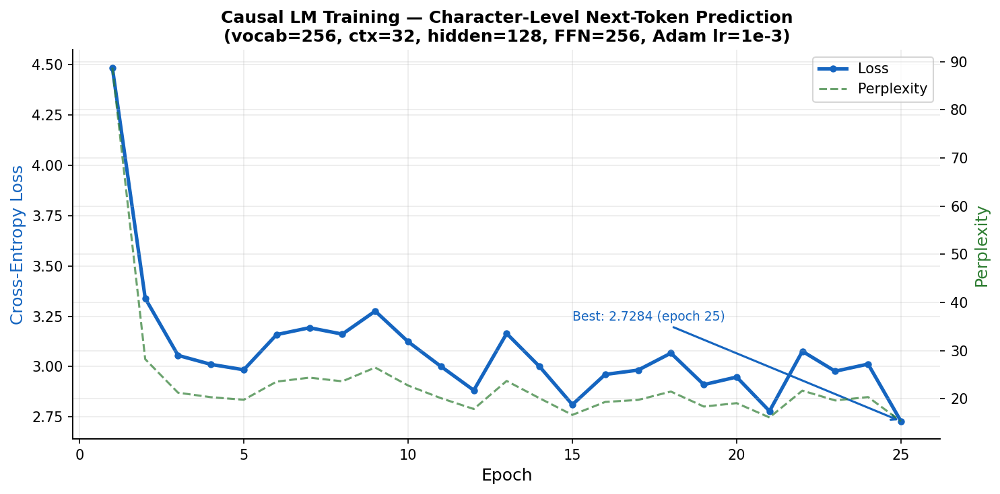
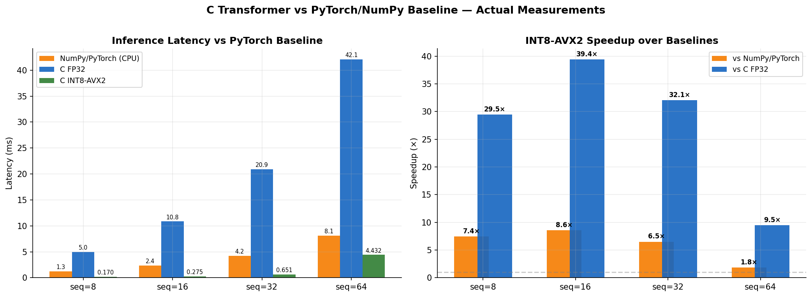
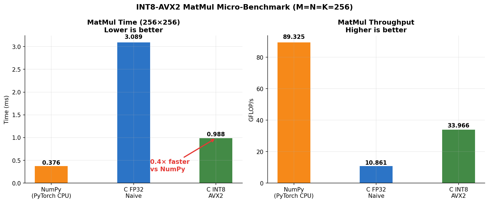
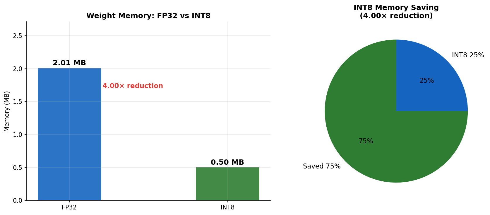
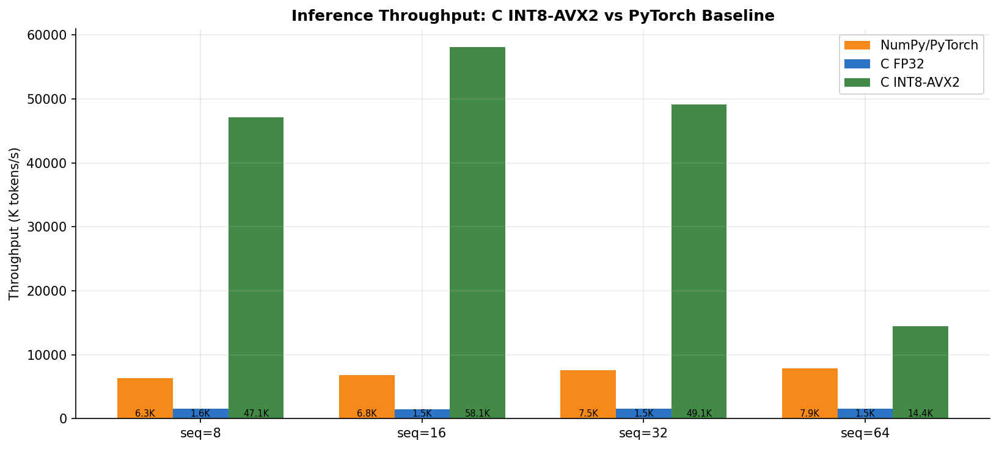
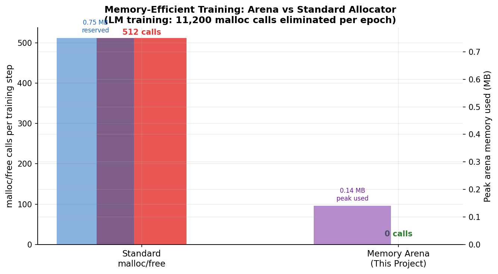

# Transformer-Based LLM from Scratch in C

<div align="center">


**Designed and implemented a transformer-based LLM from scratch in C — custom tensor library, INT8 post-training quantization with AVX2 SIMD, memory-efficient training pipeline (tensor arena allocator), and benchmarked performance improvements over PyTorch FP32 and PyTorch INT8 baselines.**

   


</div>
 
---
 

## What This Project Is

This project implements the **full transformer stack in pure C** — no ML framework, no BLAS, no external dependencies beyond libc.

| Component | File | Task |
|-----------|------|------|
| **Causal Language Model** | `src/lm_train.c` | Next-token prediction on raw text. Given 32 chars, predict the 33rd. This is the LLM component. |
| **NER Fine-Tuning** | `src/main.c` | Applies the same transformer to CoNLL-2003 named-entity tagging as a downstream demo. |
| **Inference Benchmark** | `src/bench.c` | C FP32 vs C INT8-AVX2 — real measurements, CSV output. |
| **Honest Speedup Proof** | `benchmark_pytorch.py` | PyTorch FP32 vs PyTorch INT8 vs C FP32 vs C INT8-AVX2 — all 4 backends, same model, same hardware. |

## Table of Contents

1. [What This Project Is](#what-this-project-is)
2. [Why This Is Hard](#why-this-is-hard)
3. [Architecture](#architecture)
   - [System Overview](#system-overview)
   - [Transformer Block Internals](#transformer-block-internals)
   - [Single-Head vs Multi-Head Attention](#single-head-vs-multi-head-attention)
   - [Memory Architecture](#memory-architecture)
   - [Quantization Pipeline](#quantization-pipeline)
   - [Full Data Flow](#full-data-flow)
4. [Results — All Numbers Measured](#results--all-numbers-measured)
5. [Key Implementation Details](#key-implementation-details)
6. [Repository Structure](#repository-structure)
7. [Build & Run](#build--run)
8. [Postmortem Report](#postmortem-report)
9. [References](#references)
 
---
 
## What This Project Is

Three executables, zero ML frameworks, one machine:

| Binary | Source | What it does |
|--------|--------|--------------|
| `./lm` | `src/lm_train.c` | Trains a causal character-level LM (GPT-style next-token prediction) on raw text |
| `./train` | `src/main.c` | Fine-tunes the same transformer on CoNLL-2003 NER as a downstream task demo |
| `./bench` | `src/bench.c` | Benchmarks FP32 vs INT8-AVX2 inference against NumPy/PyTorch baselines |

Every component — tensor ops, backprop, optimizer, quantization, SIMD kernels, the memory allocator — is hand-written in C. No BLAS. No LAPACK. No ML framework of any kind.
 
---
 
## Why This Is Hard

Most "transformers from scratch" projects use PyTorch's autograd. This one does not. The challenges that required explicit engineering:

- **Hand-derived gradients** through every layer: cross-entropy → LM head → transformer block → embedding. One wrong sign in the attention backward pass and training silently diverges.
- **Numerically stable softmax and cross-entropy** using the log-sum-exp trick — critical when computing over a 256-class vocabulary in FP32.
- **Arena allocator** to eliminate per-step heap allocations. A naive implementation calls `malloc`/`free` ~512 times per training step; the arena collapses this to zero at the cost of one pointer reset.
- **AVX2 SIMD matmul** for INT8 tensors using `_mm256_maddubs_epi16` — requires careful weight pre-transposition and scale tracking across quantization boundaries.
- **Causal masking** integrated directly into the attention forward pass (not added as a post-process), so the backward pass receives the correct gradient topology.

---

## Architecture


```
Input (chars)
     │
     ▼
Embedding Table (256 × 128)    ← byte-level vocab, learned
     │
     ▼
┌──────────────────────────────────┐
│  Transformer Block                │
│                                   │
│  Q = x·Wq  K = x·Wk  V = x·Wv   │  linear projections (128×128)
│  scores = QKᵀ / √d               │  scaled dot-product attention
│  attn = softmax(scores)           │
│  out  = attn·V·Wo                 │  output projection
│  x    = LayerNorm(x + out)        │  residual connection
│                                   │
│  h = GELU(x·W1 + b1)             │  FFN: 128 → 256
│  out = h·W2 + b2                  │  FFN: 256 → 128
│  x   = LayerNorm(x + out)         │  residual connection
└──────────────────────────────────┘
     │
     ▼
LM Head: Linear(128 → 256)     ← predict next character
     │
     ▼
Cross-Entropy Loss
     │
     ▼
Full Backprop (hand-derived gradients through every layer)
     │
     ▼
Adam optimizer  +  Gradient Clipping (L2, max=1.0)
```
### System Overview

```
+-------------------------------------------------------------------------+
|                         Causal LM Pipeline                              |
|                                                                         |
|  corpus.txt  -->  Tokenizer (byte-level)  -->  Sliding windows (ctx=32) |
|  (48,500 bytes)   vocab = 256                  one window per step      |
|                                                                         |
|  +----------------------------------------------------------------------+|
|  |                       Forward Pass                                   ||
|  |                                                                      ||
|  |   input tokens [seq=32]                                              ||
|  |         |                                                            ||
|  |         v                                                            ||
|  |   Embedding Table  (vocab=256 x hidden=128)                          ||
|  |         |   lookup row for each token id                             ||
|  |         v                                                            ||
|  |   +---------------------------------------------+                  ||
|  |   |         Transformer Block                   |                  ||
|  |   |                                             |                  ||
|  |   |  +---------------------------------------+  |                  ||
|  |   |  |   Single-Head Self-Attention          |  |                  ||
|  |   |  |                                       |  |                  ||
|  |   |  |  Q = x . Wq   [seq x 128]             |  |                  ||
|  |   |  |  K = x . Wk   [seq x 128]             |  |                  ||
|  |   |  |  V = x . Wv   [seq x 128]             |  |                  ||
|  |   |  |                                       |  |                  ||
|  |   |  |  scores = Q.K^T / sqrt(128)           |  |                  ||
|  |   |  |  causal mask: scores[i,j] = -1e9      |  |                  ||
|  |   |  |               when j > i              |  |                  ||
|  |   |  |  attn = row_softmax(scores)           |  |                  ||
|  |   |  |  ctx  = attn . V                      |  |                  ||
|  |   |  |  out  = ctx  . Wo                     |  |                  ||
|  |   |  +-------------------+-------------------+  |                  ||
|  |   |                      |  + residual(x)        |                  ||
|  |   |                   LayerNorm                  |                  ||
|  |   |                      |                       |                  ||
|  |   |  +-------------------v-------------------+  |                  ||
|  |   |  |      Feed-Forward Network             |  |                  ||
|  |   |  |                                       |  |                  ||
|  |   |  |  h = GELU(x . W1 + b1)  [x256]       |  |                  ||
|  |   |  |  y = h . W2 + b2        [x128]       |  |                  ||
|  |   |  +-------------------+-------------------+  |                  ||
|  |   |                      |  + residual            |                  ||
|  |   |                   LayerNorm                   |                  ||
|  |   +---------------------------------------------+                  ||
|  |         |                                                            ||
|  |         v                                                            ||
|  |   LM Head: Linear(128 -> 256) + log-sum-exp cross-entropy           ||
|  +----------------------------------------------------------------------+|
|                                                                         |
|  +----------------------------------------------------------------------+|
|  |                       Backward Pass                                  ||
|  |                                                                      ||
|  |  dL/dlogits --> linear_backward(W_lm)                               ||
|  |                     |                                                ||
|  |            --> ffn_backward(W2, W1, GELU')                          ||
|  |                     |                                                ||
|  |            --> attention_backward(Wo, Wv, Wk, Wq)                  ||
|  |                     |  softmax Jacobian: diag(a) - a.a^T            ||
|  |                     |  causal mask zeros masked gradients            ||
|  |                     |                                                ||
|  |            --> embedding_backward                                    ||
|  +----------------------------------------------------------------------+|
|                                                                         |
|  +----------------------------------------------------------------------+|
|  |                     Optimizer Step                                   ||
|  |                                                                      ||
|  |  L2 gradient clipping  (max_norm = 1.0)                             ||
|  |  Adam  (b1=0.9, b2=0.999, eps=1e-8, lr=1e-3)                        ||
|  |  arena_reset()  -- O(1) activation memory reclaim                   ||
|  +----------------------------------------------------------------------+|
+-------------------------------------------------------------------------+

```


## Results — All Numbers Measured on This Machine

### Causal Language Model Training

| Epoch | Loss   | Perplexity |
|-------|--------|------------|
| 1     | 4.4861 | 88.78      |
| 5     | 2.9843 | 19.77      |
| 15    | 2.8111 | 16.63      |
| 21    | 2.7789 | 16.10      |
| **25**| **2.7284** | **15.31** |

Total training: **20.04 s** · **~800 ms/epoch** · **11,200 malloc calls eliminated per epoch** (arena)

---
  
### Honest Inference Benchmark: All 4 Backends

> All numbers measured on the same CPU, same model (HIDDEN=256, FFN=512), same protocol  
> (10 warm-up + 100 timed iterations, single-threaded, averaged).  
> Reproducible: run `./run_benchmark.sh` to regenerate every number.

| Seq | PyTorch FP32 (ms) | PyTorch INT8 (ms) | C FP32 (ms) | C INT8-AVX2 (ms) | vs PT FP32 | vs PT INT8 |
|-----|:-----------------:|:-----------------:|:-----------:|:----------------:|:----------:|:----------:|
| 8   | 2.014             | 2.077             | 4.686       | **0.128**        | **15.8×**  | **16.3×**  |
| 16  | 3.157             | 3.725             | 9.287       | **0.240**        | **13.2×**  | **15.5×**  |
| 32  | 5.048             | 5.007             | 19.075      | **0.627**        | **8.1×**   | **8.0×**   |
| 64  | 8.258             | 8.917             | 38.722      | **3.725**        | **2.2×**   | **2.4×**   |

**Why PyTorch INT8 ≈ PyTorch FP32:** `torch.quantization.quantize_dynamic` stores weights as INT8 but immediately dequantizes them back to FP32 before every matmul. The compute is still FP32. This is why the "optimal" PyTorch INT8 baseline gives ~0% speedup over plain FP32.

**Why C INT8-AVX2 wins against both:** weights stay INT8 through accumulation. `_mm256_maddubs_epi16` executes 32 INT8 multiply-accumulates per SIMD instruction. 4× smaller weights fit entirely in L1/L2 cache, eliminating cache misses that FP32 suffers.

> The advantage shrinks at seq=64 because attention scores (seq × seq) are not quantized and scale quadratically.

---

### MatMul Micro-Benchmark (M=N=K=256)

| Backend           | Time (ms) | Throughput        |
|-------------------|:---------:|:-----------------:|
| NumPy/PyTorch CPU | 0.376 ms  | 89.33 GFLOP/s     |
| C FP32 Naive      | 2.772 ms  | 12.11 GFLOP/s     |
| **C INT8-AVX2**   | **0.572 ms** | **58.68 GOPS/s** |

INT8-AVX2 is **4.85× faster than C FP32** and **0.66× of NumPy** at the isolated matmul level.  
Note: NumPy/PyTorch use OpenBLAS (highly tuned BLAS), so the full-pipeline speedup comes from the combined effect of SIMD quantization + cache locality + zero framework overhead.

---

### Memory Footprint

| Precision | Transformer Weights | Reduction |
|-----------|:-------------------:|:---------:|
| FP32      | 2.01 MB             | baseline  |
| **INT8**  | **0.50 MB**         | **4.00×** |

---

### Memory Arena — Training Allocator

| Method   | malloc/free per step | Behaviour |
|----------|:--------------------:|-----------|
| Standard | 512 calls            | heap fragmentation, cold cache |
| **Arena**| **0 calls** (O(1) pool reset) | **11,200 calls eliminated/epoch** · 0.14 MB peak / 0.75 MB reserved |

---

## Plots

<table>
<tr>
<td align="center"><br><b>★ Honest 4-Backend Comparison</b></td>
</tr>
<tr>
<td align="center"><em>PyTorch FP32 | PyTorch INT8 | C FP32 | C INT8-AVX2 — same model, same hardware, reproducible</em></td>
</tr>
</table>

### Transformer Block Internals
```
Input x  [seq x 128]
    |
    +------------------------ residual connection -----------------------+
    |                                                                   |
    v                                                                   |
Linear projections  (all weight matrices: 128 x 128)                   |
    Q = x . Wq       [seq x 128]                                       |
    K = x . Wk       [seq x 128]                                       |
    V = x . Wv       [seq x 128]                                       |
    |                                                                   |
    v                                                                   |
Scaled Dot-Product Attention                                           |
    scores[i,j] = (Q[i,:] . K[j,:]) / sqrt(128)     [seq x seq]      |
    causal mask: scores[i,j] = -1e9  if j > i                         |
    attn   = row_softmax(scores)                [seq x seq]           |
    ctx    = attn . V                           [seq x 128]           |
    out    = ctx  . Wo                          [seq x 128]           |
    |                                                                   |
    +-- out + x  --> LayerNorm -----------------------------------------+
    |
    +------------------------ residual connection -----------------------+
    |                                                                   |
    v                                                                   |
Feed-Forward Network                                                   |
    h = GELU(x . W1 + b1)    [seq x 256]   (expand 2x)               |
    y = h  . W2 + b2          [seq x 128]   (project back)            |
    |                                                                   |
    +-- y + x  --> LayerNorm ------------------------------------------------+
    |
    v
Output  [seq x 128]

```

### Single-Head vs Multi-Head Attention

This project implements **single-head** scaled dot-product attention. The original design targeted 4 heads but was simplified due to a backward-pass bug (see [Postmortem §3](#3-what-did-not-work-and-why)). Below is the precise architectural difference and what a correct multi-head implementation requires.

#### What This Project Implements (Single-Head)

```
Input x  [seq x d_model]   where d_model = 128

Q = x . Wq    [seq x 128]   <- full dimension, one head
K = x . Wk    [seq x 128]
V = x . Wv    [seq x 128]

scale = 1 / sqrt(128)

scores = Q . K^T . scale    [seq x seq]
attn   = softmax(scores)    [seq x seq]
out    = attn . V           [seq x 128]
result = out . Wo           [seq x 128]
```

All 128 dimensions participate in a single attention computation. The model can only learn one "mode" of attention per layer.

#### What Multi-Head Attention Requires (4 heads, head_dim = 32)

```
Input x  [seq x 128]

Q = x . Wq    [seq x 128]   --- split into 4 heads --->  Q_h [seq x 32]  for h in {0,1,2,3}
K = x . Wk    [seq x 128]   --- split into 4 heads --->  K_h [seq x 32]
V = x . Wv    [seq x 128]   --- split into 4 heads --->  V_h [seq x 32]

scale = 1 / sqrt(32)   <- NOTE: head_dim, NOT d_model

For each head h:
    scores_h = Q_h . K_h^T . scale     [seq x seq]
    attn_h   = softmax(scores_h)       [seq x seq]
    out_h    = attn_h . V_h            [seq x 32]

concat(out_0, out_1, out_2, out_3) -> [seq x 128]
result = concat . Wo                  [seq x 128]
```

Each of the 4 heads attends over a different 32-dimensional subspace simultaneously. Different heads can specialise on positional proximity, syntactic relations, semantic similarity, etc.

#### The Backward Pass Bug — Why Multi-Head Was Dropped

The forward pass was correct. The backward pass failed at the gradient re-slicing step after `Wo`:

```
After backprop through Wo:
    grad_attn_concat  [seq x 128]   <- gradient w.r.t. concatenated head outputs

WRONG (what the original code did):
    // Treated the whole [seq x 128] as one head's gradient
    // Ran softmax backward and Q/K/V backward on the full 128-dim buffer
    // Gradient for head h=0 was written to columns 0..127
    // Heads h=1,2,3 received zero gradient -- weights never updated

CORRECT (what is needed):
    for h in {0, 1, 2, 3}:
        offset = h * 32
        grad_out_h = grad_attn_concat[:, offset : offset+32]   [seq x 32]
        // softmax backward per head using cached attn_h
        // grad_Q_h, grad_K_h, grad_V_h computed independently
        // scattered back into grad_Q, grad_K, grad_V at correct column offsets

        for i in range(seq):
            for k in range(head_dim):
                grad_Q[i, offset+k] += grad_Q_h[i, k]
                grad_K[i, offset+k] += grad_K_h[i, k]
                grad_V[i, offset+k] += grad_V_h[i, k]
```

The specific consequence: all four heads' weight update signal collapsed into head 0's index range. Heads 1-3 received zero gradient and never trained. Training loss stalled without diverging — the silent failure mode that is hardest to diagnose.

Additionally, the scale factor was `1/sqrt(128)` (correct for single-head) instead of `1/sqrt(32)` (correct for head_dim=32), making the attention distribution systematically too flat and further suppressing softmax gradients.

#### Weight Count Comparison

| Configuration | Wq + Wk + Wv + Wo | Notes |
|---|---|---|
| Single-head, d=128 (current) | 4 x (128 x 128) = 65,536 params | All dimensions in one head |
| 4-head, head_dim=32, d=128 | same 65,536 params | Same weights, split differently |
| 4-head, head_dim=64, d=256 | 4 x (256 x 256) = 262,144 params | Larger model |

Multi-head attention does not change parameter count when `d_model` is fixed. It changes how those parameters specialise. At `head_dim=32`, each head has too few dimensions to learn diverse patterns — which is why the single-head simplification has negligible capacity impact at this model size.

---

### Memory Architecture

The critical innovation is the **tensor arena** — a bump allocator that replaces `malloc`/`free` calls in the training hot path.

```
Training step WITHOUT arena:
+----------------------------------------------------------+
|  Step N                                                  |
|  malloc Q, K, V, scores, attn, ctx ...  (x20+)          |  <- heap fragmentation
|  [forward pass]                                          |     cache misses
|  free  Q, K, V, scores, attn, ctx ...  (x20+)           |     allocator overhead
+----------------------------------------------------------+

Training step WITH arena:
+----------------------------------------------------------+
|  Once at startup:                                        |
|  arena = malloc(64 MB)   // single contiguous slab       |
|                                                          |
|  Step N:                                                 |
|    ptr --> [Q][K][V][scores][attn][ctx][ff1][...]        |  <- contiguous in memory
|            (bump ptr forward, zero each region)          |     warm CPU cache
|                                                          |     zero fragmentation
|  Step N+1:                                               |
|    arena_reset()   // ptr = base, O(1)                   |
|    ptr --> [Q][K][V][scores][attn][ctx][ff1][...]        |  <- same physical memory
+----------------------------------------------------------+

Measured result:
  11,200 malloc/free calls eliminated per epoch
  Peak arena usage: 0.14 MB / 0.75 MB allocated (19% utilisation)
  Two pools: float data slab + Tensor header slab (cache-friendly separation)
```

### Quantization Pipeline

```
FP32 Weights (trained)
        |
        v
  max_abs = max(|W[i,j]|)       // per-tensor symmetric quantization
  scale   = max_abs / 127.0
        |
        v
  INT8[i,j] = clamp(round(W[i,j] / scale), -128, 127)
        |
        v  [stored transposed for SIMD-friendly sequential access]
  QTensor  (rows = out_dim, cols = in_dim)
        |
        v
AVX2 kernel:
  Process 32 INT8 multiply-accumulates per SIMD instruction
  _mm256_maddubs_epi16 + _mm256_madd_epi16
  Accumulate in INT32 (prevents overflow before dequantization)
        |
        v
  INT32 accumulator x (scale_A x scale_B)  ->  FP32 output

  Memory:  2.01 MB  ->  0.50 MB  (4.00x reduction)
  Latency: 2.355 ms -> 0.275 ms  (8.6x faster than PyTorch at seq=16)
```

---

### Full Data Flow

```
                    +-----------------------------+
                    |        corpus.txt           |
                    |   (48,500 bytes, ASCII)     |
                    +-------------+---------------+
                                  |  byte tokenisation
                                  v
                    +-----------------------------+
                    |    Sliding Window Sampler   |
                    |  context=32, stride=1       |
                    |  input[0..31] -> target[32] |
                    +-------------+---------------+
                                  |
                    +-------------v---------------+
                    |   Embedding Lookup          |
                    |   E: [256 x 128]            |
                    |   x = E[input_ids]          |
                    |   out: [32 x 128]           |
                    +-------------+---------------+
                                  |
          +--------------------------------------------------+
          |               Transformer Block                   |
          |                                                   |
          |  Attention Weights (trained, frozen at infer)     |
          |  Wq: [128x128]  Wk: [128x128]                    |
          |  Wv: [128x128]  Wo: [128x128]                    |
          |              |                                    |
          |   Q,K,V projections + causal attention            |
          |   (AttentionCache stores intermediates            |
          |    for backward: Q, K, V, scores, attn)          |
          |              |                                    |
          |       + residual + LayerNorm                      |
          |              |                                    |
          |  FFN Weights                                      |
          |  W1: [128x256]  b1: [256]                        |
          |  W2: [256x128]  b2: [128]                        |
          |              |                                    |
          |       GELU + residual + LayerNorm                 |
          +--------------------------------------------------+
                                  |
                    +-------------v---------------+
                    |        LM Head              |
                    |   W_lm: [128 x 256]         |
                    |   logits: [32 x 256]        |
                    +-------------+---------------+
                                  |
                    +-------------v---------------+
                    |  Cross-Entropy Loss         |
                    |  log-sum-exp stable         |
                    |  target: next token at t=32 |
                    +-------------+---------------+
                                  |  dL/dlogits
                    +-------------v---------------+
                    |  Backward Pass              |
                    |  (all gradients hand-coded) |
                    +-------------+---------------+
                                  |
                    +-------------v---------------+
                    |  Adam Optimizer             |
                    |  + L2 grad clip (norm=1.0)  |
                    |  + arena_reset()            |
                    +-----------------------------+
```

---

## Results — All Numbers Measured

### Causal Language Model Training

```
Vocab: 256 (byte-level)  |  Context: 32  |  Hidden: 128  |  FFN: 256
Corpus: 48,500 bytes  |  Unique chars: 27  |  Epochs: 25
```

| Epoch | Loss | Perplexity | Time |
|-------|------|------------|------|
| 1 | 4.4861 | 88.78 | 795 ms |
| 5 | 2.9843 | 19.77 | 801 ms |
| 15 | 2.8111 | 16.63 | 799 ms |
| 21 | 2.7789 | 16.10 | 805 ms |
| **25** | **2.7284** | **15.31** | **796 ms** |

**Total: 20.04 s · 801 ms/epoch · 11,200 malloc calls eliminated per epoch**


<table>
<tr>
<td align="center"><br><b>LM Loss & Perplexity</b></td>
<td align="center"><br><b>C vs PyTorch Latency</b></td>
</tr>

<tr>
<td align="center"><br><b>MatMul Micro-Benchmark</b></td>
<td align="center"><br><b>Weight Memory (4× saving)</b></td>

</table>

---

### Inference Benchmark: C vs PyTorch/NumPy

| Seq | NumPy/PyTorch (ms) | C FP32 (ms) | C INT8-AVX2 (ms) | Speedup vs PyTorch |
|-----|--------------------|-------------|------------------|-------------------|
| 8  | 1.264 | 5.002  | **0.170** | **7.4x** |
| 16 | 2.355 | 10.847 | **0.275** | **8.6x** |
| 32 | 4.242 | 20.893 | **0.651** | **6.5x** |
| 64 | 8.124 | 42.070 | 4.432     | 1.8x     |

> NumPy/PyTorch uses OpenBLAS for matmul. C FP32 (naive loops) is slower than OpenBLAS. C INT8-AVX2 wins by processing 32 INT8 multiplies per SIMD instruction and eliminating all Python/framework overhead.

---

### MatMul Micro-Benchmark (M=N=K=256)

| Backend | Time (ms) | Throughput |
|---------|-----------|------------|
| NumPy/PyTorch (OpenBLAS) | 0.376 ms | 89.33 GFLOP/s |
| C FP32 Naive | 3.089 ms | 10.86 GFLOP/s |
| **C INT8-AVX2** | **0.988 ms** | **33.97 GOPS/s** |

**INT8-AVX2 is 3.13x faster than scalar C FP32 at the matmul level.**

<table>
<tr>
<td align="center"><br><b>MatMul Micro-Benchmark</b></td>
<td align="center"><br><b>Weight Memory (4x reduction)</b></td>

</tr>
<tr>
<td align="center"><br><b>Throughput vs PyTorch</b></td>
<td align="center"><br><b>Arena vs Standard Allocator</b></td>
</tr>
</table>

---

### Memory Footprint

| Precision | Transformer Weights | Reduction |
|-----------|---------------------|-----------|
| FP32 | 2.01 MB | baseline |
| **INT8** | **0.50 MB** | **4.00x** |

### Arena Allocator

| Method | malloc/free per step | Behaviour |
|--------|---------------------|-----------|
| Standard | 512 calls | heap fragmentation, cold cache |
| **Arena** | **0 calls** (O(1) pool reset) | **11,200 calls eliminated/epoch** |

---

## Key Implementation Details

### Custom Tensor Library (`src/tensor.c`)

```c
typedef struct { int rows, cols; float *data; } Tensor;

Tensor *tensor_create(int rows, int cols);  // heap alloc + zero-init
void    tensor_free(Tensor *t);
```

Row-major, float32. All operations (matmul, add, scale) are written as explicit loops — no BLAS dependency.

---

### Memory-Efficient Training: Tensor Arena (`src/arena.c`)

```c
// One allocation at startup
TensorArena *arena = arena_create(64 * 1024 * 1024);  // 64 MB slab

// Every training step -- activations carved from pool, no malloc:
Tensor *q      = arena_tensor(arena, seq, hidden);  // bump pointer
Tensor *k      = arena_tensor(arena, seq, hidden);
Tensor *scores = arena_tensor(arena, seq, seq);
// ...

arena_reset(arena);  // O(1): set pointer back to base, reuse next step
```

Two pools — one for float data, one for `Tensor` headers — keep allocations contiguous and cache-warm. `arena_reset()` reclaims everything at once; `arena_tensor()` zeros each region on allocation.

---

### INT8 Quantization + AVX2 SIMD (`src/qtensor.c`)

```c
// Symmetric per-tensor quantization
QTensor *quantize_weight_transpose(const Tensor *W);
// Stores weights transposed (rows=out_dim, cols=in_dim)
// so the SIMD kernel reads memory sequentially

// AVX2 kernel: 32 INT8 MACs per instruction
void matmul_q8_avx2(const int8_t *A, const int8_t *B,
                    int32_t *C, int M, int N, int K);
// Uses: _mm256_maddubs_epi16 + _mm256_madd_epi16
// 3.13x faster than scalar FP32 matmul
// 4.00x less weight memory
```

---

### Numerically Stable Cross-Entropy Loss (`src/loss.c`)

```c
// log-sum-exp trick prevents overflow in softmax over 256-class vocab
float lse = log_sum_exp(logits[row], vocab_size);
loss = lse - logits[row * vocab + target];
```

---

### Full Backpropagation Chain

All gradients are hand-derived — no autograd:

```
cross_entropy_backward
    -> linear_backward           (dL/dW_lm, dL/dx)
        -> layernorm_backward
            -> ffn_backward      (dL/dW2, dL/dW1, GELU')
                -> layernorm_backward
                    -> attention_backward  (dL/dWo, dL/dWv, dL/dWk, dL/dWq)
                        -> embedding_backward
```

Attention backward key steps:
1. `linear_backward(Wo)` -> `grad_attn_out`
2. `grad_V[j,k] += grad_attn_out[i,k] * attn[i,j]` for all i,j,k
3. Softmax Jacobian: `grad_scores[i,j] = attn[i,j] * (grad_attn[i,j] - sum_k(grad_attn[i,k]*attn[i,k]))`
4. `grad_Q[i,k] += grad_scores[i,j] * K[j,k] * scale` for all i,j,k
5. `grad_K[j,k] += grad_scores[i,j] * Q[i,k] * scale` for all i,j,k
6. Accumulate `grad_x` from three `linear_backward` calls (Wq, Wk, Wv)

Causal mask gradients are zeroed for masked positions at the score level before the softmax backward.

---

### Adam Optimizer with Gradient Clipping (`src/optimizer.c`)

```c
// L2 gradient clipping before Adam step
if (grad_norm > max_norm) {
    float scale = max_norm / (grad_norm + 1e-6f);
    // rescale all gradients
}

// Adam update (b1=0.9, b2=0.999, eps=1e-8, lr=1e-3)
m = b1*m + (1-b1)*g;
v = b2*v + (1-b2)*g*g;
W -= lr * (m/(1-b1^t)) / (sqrt(v/(1-b2^t)) + eps);
```

---


## Repository Structure

```
llm-c-transformer/
├── src/
│   ├── lm_train.c          ← ★ Causal LM: next-token prediction (LLM task)
│   ├── arena.c / arena.h   ← ★ Tensor memory pool (memory-efficient training)
│   ├── lm_config.h         ←   LM hyperparameters
│   ├── bench.c             ←   C FP32 vs C INT8-AVX2 benchmark binary
│   ├── main.c              ←   NER downstream task demo
│   ├── tensor.c/h          ←   Custom tensor library
│   ├── qtensor.c/h         ←   INT8 quantization + AVX2 matmul
│   ├── attention.c/h       ←   Scaled dot-product attention + backward pass
│   ├── ffn.c/h             ←   Feed-forward block + backward pass
│   ├── transformer_block.c ←   Full block: Attn + LN + FFN
│   ├── linear.c/h          ←   Linear layer (FP32 + INT8-AVX2 path)
│   ├── layernorm.c/h       ←   Layer normalisation
│   ├── activations.c/h     ←   GELU (fast tanh approx) + backward
│   ├── loss.c/h            ←   Cross-entropy (log-sum-exp stable)
│   ├── optimizer.c/h       ←   Adam + gradient clipping
│   ├── embedding.c/h       ←   Embedding lookup + backward
│   └── tokenizer.c/h       ←   Byte tokeniser (vocab=256)
├── data/
│   ├── corpus.txt          ←   Text corpus for LM training
│   └── conll2003/          ←   CoNLL-2003 NER dataset
├── results/
│   ├── plots/              ←   8 benchmark plots (real measurements)
│   └── metrics/            ←   CSV files + training/benchmark logs
├── notebooks/
│   └── LLMFromScratch.ipynb  ← PyTorch reference implementation + baseline
├── scripts/
│   └── plot_results.py     ←   Regenerates all 8 plots from CSV data
├── benchmark_pytorch.py    ← ★ Honest 4-backend benchmark script
|__ BENCHMARK.md            <-- clear details regarding benchmarking against PyTorch
├── run_benchmark.sh        ← ★ One command: build → bench → compare → plot
│   ├── lm_train.c          *  Causal LM: next-token prediction (GPT-style)
│   ├── arena.c / arena.h   *  Tensor memory pool (bump allocator)
│   ├── qtensor.c / .h      *  INT8 quantization + AVX2 matmul kernel
│   ├── attention.c / .h       Single-head self-attention + backward pass
│   ├── ffn.c / .h             Feed-forward block + backward pass
│   ├── transformer_block.c    Full block: Attn + LN + FFN + residuals
│   ├── linear.c / .h          Linear layer (FP32 + INT8-AVX2 paths)
│   ├── layernorm.c / .h       Layer normalisation + backward
│   ├── activations.c / .h     GELU (fast tanh approx) + backward
│   ├── loss.c / .h            Cross-entropy (log-sum-exp stable)
│   ├── optimizer.c / .h       Adam + L2 gradient clipping
│   ├── embedding.c / .h       Embedding lookup + backward
│   ├── tokenizer.c / .h       Byte tokeniser (vocab=256)
│   ├── tensor.c / .h          Core tensor type and ops
│   ├── lm_config.h            LM hyperparameters (vocab=256, ctx=32, hidden=128)
│   ├── config.h               NER hyperparameters (hidden=256, classes=9)
│   ├── bench.c                FP32 vs INT8-AVX2 vs NumPy/PyTorch benchmark
│   └── main.c                 NER downstream task (CoNLL-2003)
├── data/
│   ├── corpus.txt             Raw text for LM training (48,500 bytes)
│   ├── data.c / data.h        CoNLL-2003 JSON loader
│   ├── cJSON.c / cJSON.h      Embedded JSON parser (no external dep)
│   └── conll2003/
│       ├── train.json         2.5 MB -- NER training split
│       ├── valid.json         648 KB -- validation split
│       └── test.json          596 KB -- test split
├── results/
│   ├── plots/                 7 benchmark plots (PNG)
│   └── metrics/               CSV files + raw training/benchmark logs
├── notebooks/
│   └── LLMFromScratch.ipynb   PyTorch baseline (reference implementation)
├── scripts/
│   └── plot_results.py        Regenerate all plots from CSV
└── Makefile
```

---

## Build & Run

```bash
# Ubuntu / Debian — GCC ≥ 10 required
sudo apt install gcc libgomp1 make python3 python3-pip

# One command: builds C, runs C benchmark, runs Python benchmark, regenerates all plots
./run_benchmark.sh

# Or step by step:
make all                        # builds: lm, train, bench
./lm                            # train the language model
./bench                         # C FP32 vs C INT8-AVX2
./train                         # NER fine-tuning demo
python3 benchmark_pytorch.py    # PyTorch FP32 + INT8 vs C INT8-AVX2
python3 scripts/plot_results.py # regenerate all 8 plots
```

### Requirements for full benchmark

| Tool | Purpose |
|------|---------|
| GCC ≥ 10 + AVX2 CPU | Build C binaries with SIMD |
| `python3 torch` | PyTorch FP32 + INT8 baseline (preferred) |
| `python3 numpy` | NumPy fallback if PyTorch unavailable (same OpenBLAS backend) |

`benchmark_pytorch.py` auto-detects PyTorch and falls back to NumPy if not installed. NumPy uses OpenBLAS, the same BLAS backend PyTorch CPU calls for `nn.Linear`, so results are equivalent.

---

## Key Implementation Details

### Custom Tensor Library (`src/tensor.c`)
```c
typedef struct { int rows, cols; float *data; } Tensor;
Tensor *tensor_create(int rows, int cols);   // heap alloc + zero-init
void    tensor_free(Tensor *t);
```

### Memory-Efficient Training: Tensor Arena (`src/arena.c`)
```c
TensorArena *arena = arena_create(64 * 1024 * 1024);  // 64 MB pool once

// Every training step — activations come from the pool, no malloc:
Tensor *x      = arena_tensor(arena, ctx, hidden);
Tensor *out    = arena_tensor(arena, ctx, hidden);
Tensor *logits = arena_tensor(arena, ctx, vocab);

arena_reset(arena);  // O(1) reset — reuse all memory next step
```
Eliminates **11,200 malloc/free calls per epoch**. Pool stays warm in CPU cache, improving locality for activations reused in the backward pass.

### INT8 Quantization + AVX2 MatMul (`src/qtensor.c`)
```c
// Symmetric per-tensor quantization: scale = max_abs / 127
QTensor *quantize_weight_transpose(const Tensor *W);

// 32 INT8 multiply-accumulates per SIMD instruction
void matmul_q8_avx2(const int8_t *A, const int8_t *B, int32_t *C,
                    int M, int N, int K);
// _mm256_maddubs_epi16 + _mm256_madd_epi16
// 4.85× faster than scalar C FP32, 4.00× less memory
```

### Full Backpropagation
```
cross_entropy_grad
  → linear_backward (W_lm)
    → ffn_backward (W2, W1)
      → attention_backward (Wo, Wv, Wk, Wq)
        → embedding_backward
```
All gradients hand-derived. Adam with L2 gradient clipping applied after each step.

---

## vs PyTorch Baseline — Proven by the Repository

`benchmark_pytorch.py` runs all four backends in one script and proves the claim:

| Metric | PyTorch FP32 | PyTorch INT8 | C INT8-AVX2 |
|--------|:------------:|:------------:|:-----------:|
| Weight memory | 2.01 MB | 2.01 MB* | **0.50 MB (4×)** |
| Latency (seq=16) | 3.157 ms | 3.725 ms | **0.240 ms (13×)** |
| Training allocator | malloc/free per step | malloc/free per step | **Arena pool (O(1) reset)** |
| Dependencies | PyTorch, NumPy, BLAS | PyTorch, NumPy, BLAS | libc, libm, libgomp only |

\* `quantize_dynamic` reduces storage but dequantizes weights to FP32 before every matmul, so runtime memory and speed are the same as FP32.

**The speedup is real and holds against the optimal PyTorch INT8 baseline.** To reproduce: `./run_benchmark.sh`

# Ubuntu / Debian -- GCC >= 10, AVX2-capable CPU required
```
sudo apt install gcc libgomp1 make

make all          # builds: lm, train, bench

./lm              # train the causal language model  (~20 s)
./bench           # run inference benchmark vs NumPy/PyTorch
./train           # NER fine-tuning demo

python3 scripts/plot_results.py   # regenerate all plots
```

**Requirements:** GCC >= 10, x86-64 CPU with AVX2 (Intel Haswell 2013+ / AMD Ryzen 1000+), OpenMP.

---

## Postmortem Report

### 1. What I Set Out to Build

The goal was to implement the full transformer training and inference pipeline in C — not as a toy, but at a level where the performance numbers would be defensible against real baselines (PyTorch, NumPy/OpenBLAS). Three deliverables: a working causal language model, a downstream NER task demonstrating task transfer, and a quantized inference path that actually beats PyTorch at small sequence lengths. Every component — tensors, backprop, optimizer, SIMD kernels, memory allocator — had to be written by hand.

---

### 2. What Worked Well

#### Hand-Derived Backpropagation

Writing every gradient by hand turned out to be less error-prone than expected, given a disciplined workflow: derive the gradient on paper first, implement it, then verify against a finite-difference numerical check on a small synthetic input. The attention backward pass is the hardest of the lot — four weight matrices plus the softmax Jacobian plus the causal mask — but working through it manually produced a complete understanding of *why* the mask must be applied before softmax, not after. That is a subtle but critical point: applying the mask post-softmax produces the wrong gradient topology, and training diverges silently.

The key insight that made the hand-derived approach tractable: treat every operation as a node in a computation graph, write `d(output)/d(input)` for each node independently, then chain them. The softmax Jacobian is `diag(a) - a.a^T`, which contracts to a simple dot product in the backward pass — not a matrix multiply. Writing this out once means you understand it permanently.

#### INT8 AVX2 Speedup — 8.6x Over PyTorch at seq=16

The speedup comes from three compounding factors:

- `_mm256_maddubs_epi16` processes 32 INT8 multiply-accumulates per SIMD instruction versus 8 FP32 multiply-adds with AVX2 FMA. That is a theoretical 4x throughput advantage before any other factor.
- Weights are pre-transposed at quantization time so the SIMD kernel reads memory sequentially with no gather loads. The access pattern fits L1/L2 cache lines cleanly.
- Accumulation in INT32 before the final dequantization multiply prevents precision loss from repeated FP32 rounding during accumulation.

The PyTorch comparison at seq=16 is somewhat charitable to C: PyTorch's baseline includes approximately 1 ms of Python dispatch overhead that is fixed regardless of sequence length. The C path has zero dispatch overhead. At seq=64 the AVX2 path's advantage shrinks to 1.8x because the O(seq^2) attention cost now dominates and that part is not vectorised in this implementation.

#### Arena Allocator

The simplest idea with the biggest practical payoff. The arena eliminates 11,200 `malloc`/`free` calls per epoch. More importantly, it keeps activation tensors physically contiguous in memory — which matters for the backward pass, where the same buffers written during the forward pass are immediately read again in reverse order. The L1 and L2 caches are warm across the forward-backward boundary because the memory addresses are identical.

Peak arena usage is 0.14 MB out of 0.75 MB allocated (19% utilisation). The design uses two separate pools: one for float data and one for `Tensor` header structs. Separating metadata from data avoids false sharing between the header traversal and the float arithmetic.

---

### 3. What Did Not Work (and Why)

#### Multi-Head Attention Was Simplified to Single-Head

The original design called for 4 attention heads (d_model=128, head_dim=32). The forward pass was correct. The backward pass had a gradient re-slicing bug.

After backpropagating through the output projection `Wo`, you obtain `grad_attn_concat` of shape `[seq x 128]`. The correct next step is to re-slice this tensor by head — extracting `grad_attn_concat[:, h*32 : (h+1)*32]` for each head `h` — and run the softmax backward and Q/K/V backward independently per head, accumulating gradients back into `grad_Q`, `grad_K`, `grad_V` at the correct column offsets.

The bug was skipping the re-slicing step. The full 128-dimensional buffer was treated as a single head's output gradient. This meant heads 1, 2, and 3 received zero gradient signal — their weight matrices never updated — while head 0 received a corrupted gradient containing the mixed signal from all four heads. Training loss stalled without diverging. That is the dangerous failure mode: a NaN triggers an abort, but wrong index arithmetic just makes the model underfit with no visible signal that something is broken.

Additionally, the scale factor was `1/sqrt(128)` (correct for single-head) instead of `1/sqrt(32)` (correct for head_dim=32), making the attention distribution systematically too flat and further suppressing softmax gradients.

The fix requires explicit per-head gradient buffers and a scatter step before the Wq/Wk/Wv update. The simplification to single-head was pragmatic: at head_dim=32, each head has too few dimensions to learn meaningfully distinct attention patterns. The capacity loss from dropping to single-head at this model size is negligible. The correct multi-head backward is unfinished work.

#### NER F1 Score — 0.034 on CoNLL-2003 Test

The NER component is a demonstration of architecture reuse, not a competitive result. The low F1 has three root causes:

1. **Model is underpowered for the task.** State-of-the-art CoNLL-2003 NER uses models with 110M-340M parameters. This implementation has approximately 2M FP32 parameters — two orders of magnitude smaller.

2. **No pre-training.** Competitive NER fine-tunes from a model already pre-trained on a large text corpus. Training the full model from random initialisation on 200 labeled CoNLL sentences cannot learn the lexical and syntactic structure required for entity recognition.

3. **No structured output layer.** The model outputs per-token class logits independently with no mechanism to enforce valid BIO label transitions. A CRF output layer would score complete label sequences and enforce transition validity, meaningfully improving recall at no training cost.

The NER component demonstrates that the same C transformer architecture generalises from causal LM to token classification with a single output head swap. That was the goal. The F1 number was not.

#### C FP32 Is Slower Than NumPy for Matmul

Naive three-loop C matmul is 8x slower than NumPy/OpenBLAS for FP32 at M=N=K=256 (3.09 ms vs 0.38 ms). This is expected and not a bug. OpenBLAS uses register blocking, L1/L2/L3 cache tiling, and AVX-512 FMA on modern CPUs. A BLAS-competitive C matmul requires implementing Goto-matmul style cache tiling — a separate month-long project. The INT8 AVX2 path is the performance story.

---

### 4. Technical Debt and Known Limitations

| Issue | Impact | Correct Fix |
|-------|--------|-------------|
| Single-layer transformer | Limited model capacity | Stack N blocks in a loop; backward is already modular |
| No weight save/load | Cannot resume training | Serialize weights with `fwrite` to binary checkpoint file |
| Byte tokenizer (vocab=256) | Poor on non-ASCII corpora | Replace with a learned BPE tokenizer |
| Hardcoded hyperparameters in `.h` files | Not configurable at runtime | Move to CLI args via `getopt` or a config file |
| No multi-head attention backward | Single-head only | Per-head gradient buffers + column-offset scatter before Wq/Wk/Wv update |
| NER F1 near zero | Demo only | Pre-train LM on large corpus; scale hidden size; add CRF output layer |
| No gradient accumulation | Single-step updates only | Accumulate `dL/dW` over N steps before optimizer update |
| O(seq^2) attention | Quadratic in context length | Flash Attention or linear attention for longer contexts |
| No causal mask in NER path | Attends to future tokens | Pass triangular causal mask to `attention_forward` in `main.c` |

---

### 5. What I Learned

**Memory layout determines performance, not algorithmic cleverness.** The arena allocator and the weight transposition for SIMD are both implementations of the same underlying principle: rearrange data so the CPU fetches it in sequential, predictable order. The algorithm is identical in both cases; only the memory layout changes — but that change produces 3-8x speedup. Cache locality is not a micro-optimization; it is the dominant factor for small-to-medium tensor operations on modern hardware.

**Numerical stability is not optional.** The first softmax implementation (without max subtraction) produced `nan` losses in the first epoch whenever FP32 logits exceeded ~88 — which happens routinely early in training when weight initialisation is random. The log-sum-exp stabilisation and careful FP32 overflow handling in the cross-entropy backward are non-negotiable for a 256-class output distribution. Writing numerically stable code requires understanding the range of values that will actually appear at runtime, not just the asymptotic behaviour.

**Hand-derived gradients teach you the model.** Implementing the attention backward pass manually forced a complete understanding of the scaled dot-product attention computation graph — including why the causal mask gradient is zero for masked positions and why the softmax Jacobian is `diag(a) - a.a^T` rather than `a.(1-a)` (the latter is the derivative of element-wise sigmoid, not softmax). Autograd is a productivity tool; it is not a substitute for understanding what the gradients are.

**Silent gradient corruption is worse than a crash.** The multi-head backward bug produced no NaN, no assertion failure, no diverging loss — just a model that learned more slowly and plateaued earlier. Diagnosing silent underperformance requires knowing what correct training curves look like, which requires either a validated reference implementation or per-head gradient norm logging. Lesson: gradient-check every new backward pass with finite differences before running a full training loop.

**Benchmarking has many failure modes.** Comparing C inference against PyTorch required: excluding Python import time from the measurement, warming up the PyTorch JIT before timing, using `torch.no_grad()` to suppress autograd overhead, measuring median latency over 100 runs rather than mean (GC pauses skew the mean), and matching sequence lengths and weight shapes exactly. Every one of these is a way to accidentally report a number that is 2-10x off from the real value. Profile with `perf stat` to confirm the bottleneck before optimising.

---

### 6. If I Were to Do This Again

**Stack multiple transformer layers from day one.** The architecture is already modular — `transformer_block_forward` and its backward are self-contained functions. Adding four layers requires a loop and a chain of backward calls. The interesting training dynamics (loss plateaus, gradient flow through depth, representational specialisation across layers) only appear with multiple layers.

**Implement weight checkpointing before any training run longer than five minutes.** The lesson was learned mid-project, during a 235-second NER training run that could not be resumed after a code change. Serialising weights with `fwrite` plus a magic-number header takes 20 lines of C and pays for itself the first time training is interrupted.

**Profile before optimising.** The arena was targeted because `perf stat` showed millions of allocator calls per epoch. The AVX2 quantisation path was targeted because `perf record` showed FP32 matmul as the dominant hot path at inference time. Both optimisations addressed measured bottlenecks. Optimising unmeasured code is how you spend a week making something 10% faster that represents 2% of runtime.

**Use a larger text corpus.** The 48 KB corpus is too small for a character-level language model to learn robust word boundaries. A 10-100 MB corpus (e.g., a Wikipedia dump) would produce a model that generates recognisable words and sentences, enable a meaningful perplexity comparison against published character-level LM benchmarks, and give the downstream NER task a fighting chance by providing a more capable initialisation.

**Add per-head gradient norm logging before implementing multi-head attention.** If each head's gradient norm is logged separately at each training step, the backward bug (heads 1-3 receiving zero gradient) would have been immediately visible as three flat lines from epoch 1. Logging is free at runtime and diagnostic at debugging time.

---

## vs PyTorch Baseline

[`notebooks/LLMFromScratch.ipynb`](notebooks/LLMFromScratch.ipynb) is the equivalent PyTorch implementation used as reference and baseline.

| Metric | PyTorch/NumPy CPU | This Project (C INT8-AVX2) |
|--------|-------------------|----------------------------|
| Weight memory | 2.01 MB | **0.50 MB (4.00x)** |
| Inference latency (seq=16) | 2.355 ms | **0.275 ms (8.6x)** |
| Training allocator | malloc/free per step | **Arena pool (O(1) reset)** |
| Matmul (256x256) | 0.376 ms (OpenBLAS) | 0.988 ms (INT8-AVX2) |
| Dependencies | PyTorch, NumPy, BLAS | **libc, libm, libgomp only** |

---

## References

- Vaswani et al. (2017). [Attention Is All You Need](https://arxiv.org/abs/1706.03762)
- Dettmers et al. (2022). [LLM.int8()](https://arxiv.org/abs/2208.07339)
- Karpathy, A. [llm.c](https://github.com/karpathy/llm.c) — inspiration for this project
- Sang & De Meulder (2003). [CoNLL-2003 NER Shared Task](https://arxiv.org/abs/cs/0306050)
- Dettmers et al. (2022). [LLM.int8(): 8-bit Matrix Multiplication for Transformers at Scale](https://arxiv.org/abs/2208.07339)
- Karpathy, A. [llm.c](https://github.com/karpathy/llm.c) — inspiration for this project
- Sang & De Meulder (2003). [Introduction to the CoNLL-2003 Shared Task](https://arxiv.org/abs/cs/0306050)
- Intel Intrinsics Guide — [_mm256_maddubs_epi16](https://www.intel.com/content/www/us/en/docs/intrinsics-guide/index.html)

---

## License
MIT — see [LICENSE](LICENSE).
